# ☁️ VAULT — Distributed File Storage System

<p align="center">
  
  
  
  
  
  
  
  
</p>

<p align="center">
  <strong>A production-oriented cloud file storage platform inspired by Dropbox / Google Drive.</strong>
  <br />
  Chunked uploads • resumable transfers • object storage • metadata • folders • sharing • access control • cloud deployment
</p>

<p align="center">
  <a href="https://vault-frontend-beryl.vercel.app/">🚀 Live Demo</a>
  &nbsp; • &nbsp;
  <a href="https://github.com/pratik3847/distributed-file-storage-system">💻 Source Code</a>
</p>

---

## ✨ What is Vault?

**Vault** is a full-stack distributed file storage system designed to solve a simple but non-trivial problem:

> **How do you build a cloud file manager that can reliably store, organize, upload, retrieve, and share files without treating the database itself as a blob store?**

Instead of putting large binary files directly inside PostgreSQL, Vault separates:

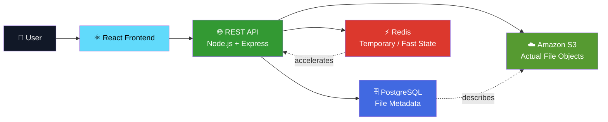

### The core idea

```text
PostgreSQL  →  WHAT the file is
S3          →  WHERE the actual bytes live
Redis       →  FAST temporary / operational state
```

That separation is the foundation of the system.

---

# 🧭 Table of Contents

- [✨ What is Vault?](#-what-is-vault)
- [🏗️ System Architecture](#️-system-architecture)
- [🗺️ Architecture at a Glance](#️-architecture-at-a-glance)
- [🧱 Major Components](#-major-components)
- [⚛️ Frontend Architecture](#️-frontend-architecture)
- [🧠 Backend Architecture](#-backend-architecture)
- [🔐 Authentication Flow](#-authentication-flow)
- [📦 File Upload Architecture](#-file-upload-architecture)
- [🔄 Resumable Chunk Upload](#-resumable-chunk-upload)
- [☁️ S3 Storage Architecture](#️-s3-storage-architecture)
- [🗄️ Metadata Architecture](#️-metadata-architecture)
- [⚡ Redis Architecture](#-redis-architecture)
- [📁 Folder & File Management](#-folder--file-management)
- [🤝 File Sharing](#-file-sharing)
- [🗑️ Trash & Restore](#️-trash--restore)
- [🛡️ Security Architecture](#️-security-architecture)
- [🌐 AWS Infrastructure](#-aws-infrastructure)
- [⚖️ Load Balancer & Target Groups](#️-load-balancer--target-groups)
- [📈 Auto Scaling Architecture](#-auto-scaling-architecture)
- [🔒 HTTPS & Vercel Proxy](#-https--vercel-proxy)
- [🚀 Deployment Flow](#-deployment-flow)
- [🔁 Complete Request Lifecycle](#-complete-request-lifecycle)
- [🧯 Failure Scenarios](#-failure-scenarios)
- [📊 Why This Architecture?](#-why-this-architecture)
- [🧰 Technology Stack](#-technology-stack)
- [📂 Project Structure](#-project-structure)
- [🔌 API Surface](#-api-surface)
- [🧪 Local Development](#-local-development)
- [☁️ Production Deployment](#️-production-deployment)
- [💡 Engineering Decisions](#-engineering-decisions)
- [🛣️ Future Evolution](#️-future-evolution)
- [📚 What I Learned](#-what-i-learned)

---

# 🏗️ System Architecture

The deployed architecture is intentionally **simple enough to operate**, while still demonstrating real cloud infrastructure.

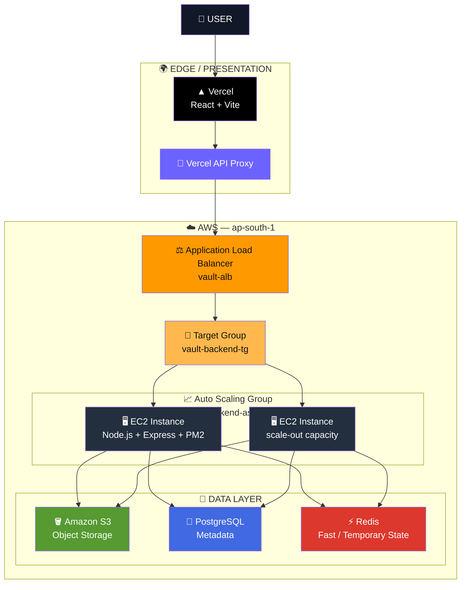

> **Important:** the ASG/ALB infrastructure is part of the deployed architecture. The current operating capacity can be kept at one backend instance; the second instance represents the scale-out path rather than a requirement to keep two instances running continuously.

---

# 🗺️ Architecture at a Glance

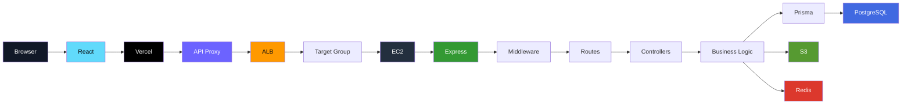

---

# 🧱 Major Components

| Layer | Component | Responsibility |
|---|---|---|
| Presentation | React + Vite | UI, navigation, forms, file manager |
| Edge | Vercel | Frontend hosting + API proxy |
| Routing | ALB | Distribute HTTP traffic to backend targets |
| Compute | EC2 | Run Node.js backend |
| Process | PM2 | Keep backend process alive |
| Scaling | ASG | Maintain backend capacity |
| API | Express | REST API + middleware |
| Auth | JWT | Authentication |
| Metadata | PostgreSQL | Users, files, folders, permissions, state |
| ORM | Prisma | Type-safe database access |
| Temporary state | Redis | Fast operational/cache/session state |
| Blob storage | S3 | Actual file objects |

---

# ⚛️ Frontend Architecture

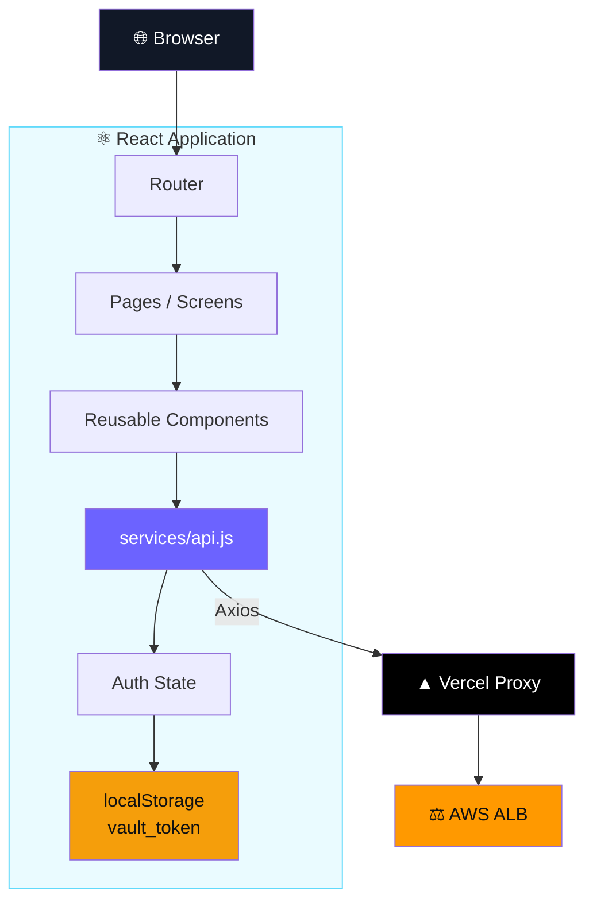

### API client pattern

Production:

```text
React
  │
  ├── /auth/...
  ├── /files/...
  ├── /uploads/...
  ├── /users/...
  └── /api/folders/...
           │
           ▼
      Vercel Rewrite
           │
           ▼
          ALB
```

Development:

```text
React
   │
   ▼
http://localhost:5000
```

---

# 🧠 Backend Architecture

The backend follows a modular Express architecture.

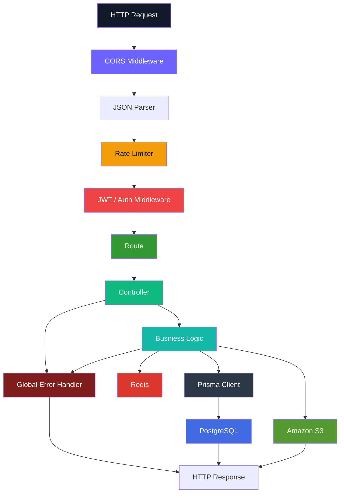

### Backend request philosophy

```text
REQUEST
   ↓
Validate
   ↓
Authenticate
   ↓
Authorize
   ↓
Execute business logic
   ↓
Persist / retrieve data
   ↓
Return structured response
```

---

# 🔐 Authentication Flow

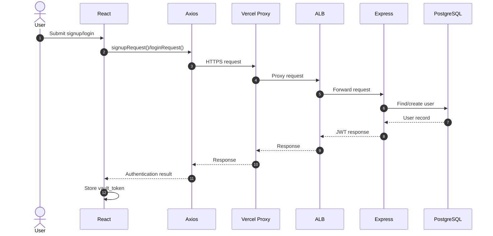

### Authenticated request

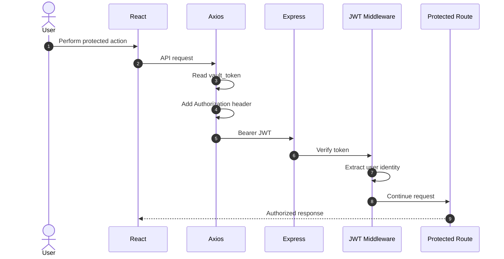

---

# 📦 File Upload Architecture

Vault separates the **file transfer process** from **file metadata**.

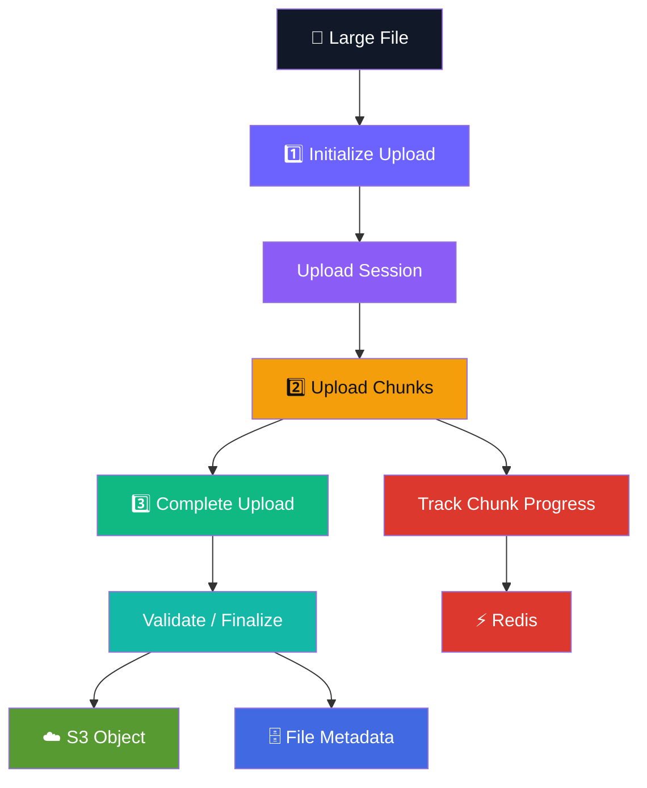

---

# 🔄 Resumable Chunk Upload

The key idea:

> **A large file is transferred as independently addressable pieces rather than relying on one giant request.**

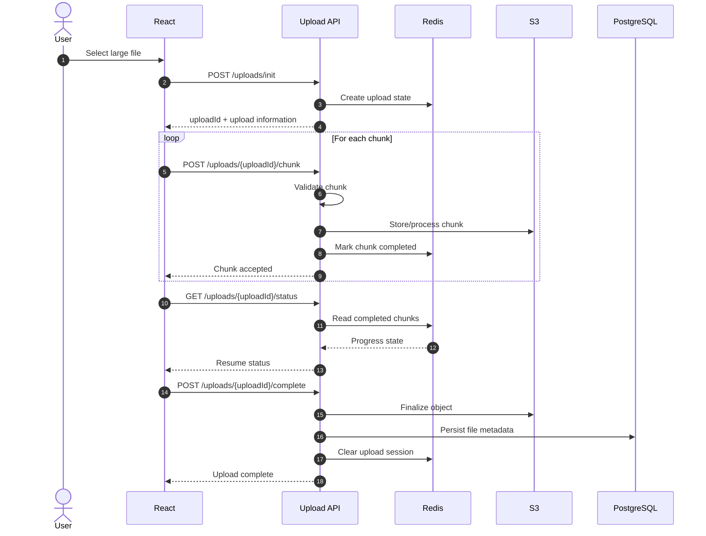

### Why chunk uploads?

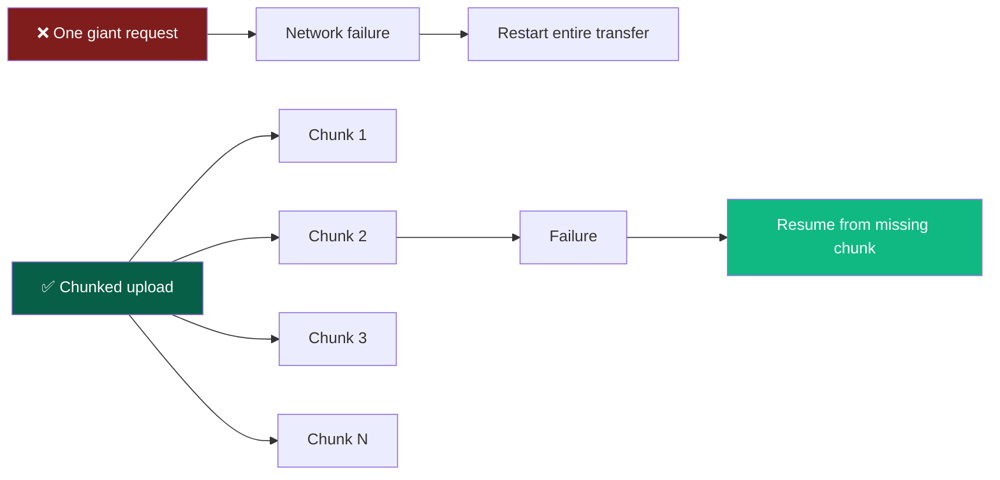

---

# ☁️ S3 Storage Architecture

The system deliberately avoids treating PostgreSQL as the binary storage layer.

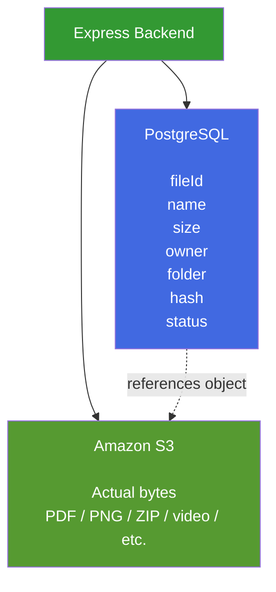

### Why this separation?

```text
                 FILE
                  │
          ┌───────┴────────┐
          │                │
          ▼                ▼
     Metadata             Bytes
          │                │
          ▼                ▼
   PostgreSQL              S3
```

**PostgreSQL is optimized for structured relational data.**

**S3 is optimized for durable object storage.**

---

# 🗄️ Metadata Architecture

Think of PostgreSQL as the system's **index / source of truth for file relationships and application state**.

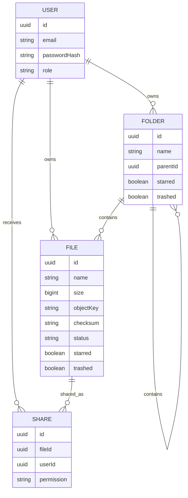

> The exact schema can evolve as the project grows; this diagram describes the logical relationships rather than claiming a literal column-for-column schema.

---

# ⚡ Redis Architecture

Redis is used where **fast, short-lived state** is more appropriate than durable relational storage.

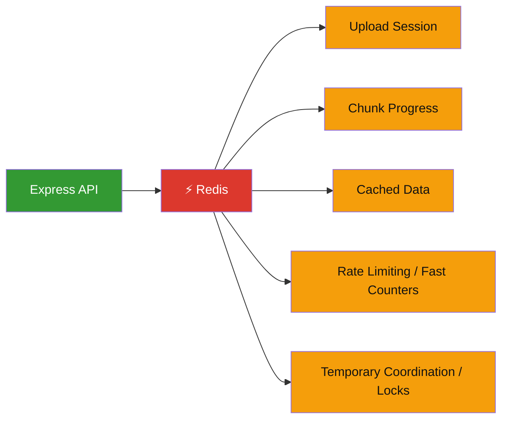

### Mental model

```text
PostgreSQL
    ↓
Durable application state

Redis
    ↓
Fast temporary operational state

S3
    ↓
Durable binary objects
```

---

# 📁 Folder & File Management

Vault supports a file-manager style hierarchy.

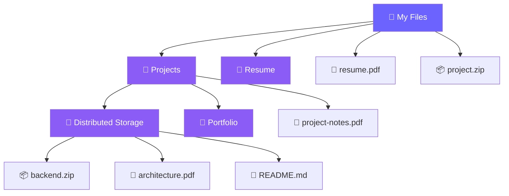

Supported operations include:

```text
CREATE FOLDER
GET FOLDER
UPDATE FOLDER
MOVE FOLDER
STAR FOLDER
TRASH FOLDER
RESTORE FOLDER
DELETE FOLDER
```

---

# 🤝 File Sharing

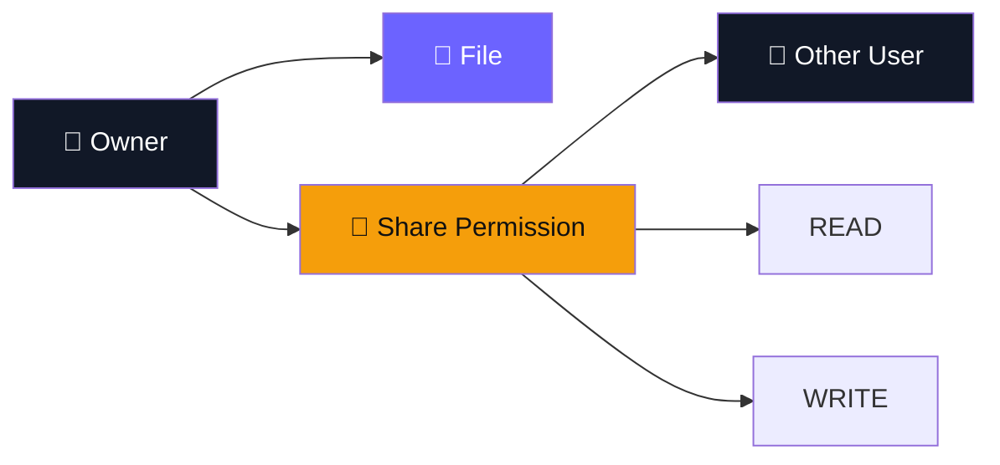

Sharing is enforced at the API/business-logic layer so that access is not determined merely by knowing a file identifier.

---

# 🗑️ Trash & Restore

Vault uses a soft-delete style workflow for files/folders.

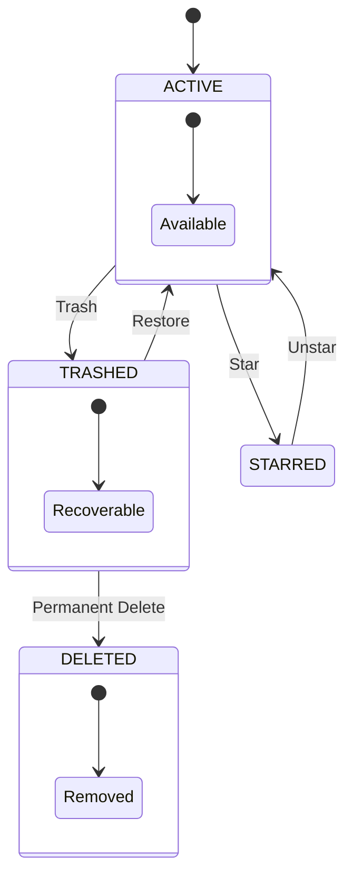

This gives the application a safer UX than immediately destroying every user action.

---

# 🛡️ Security Architecture

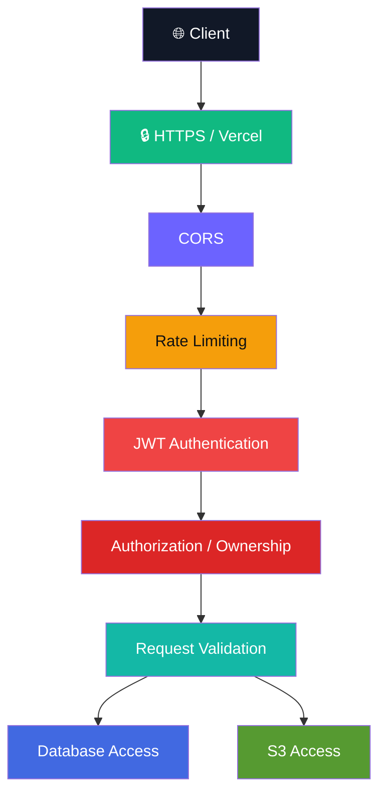

### Security mechanisms

- JWT-based authentication
- Authorization checks
- CORS restrictions
- API rate limiting
- Environment-based secrets
- Controlled S3 access
- Checksum/integrity validation
- ALB-based production routing
- HTTPS at the public frontend boundary

---

# 🌐 AWS Infrastructure

The AWS deployment is organized around a VPC and multiple Availability Zones.

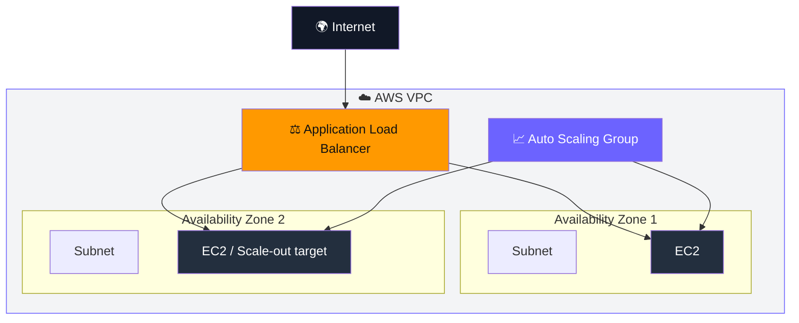

---

# ⚖️ Load Balancer & Target Groups

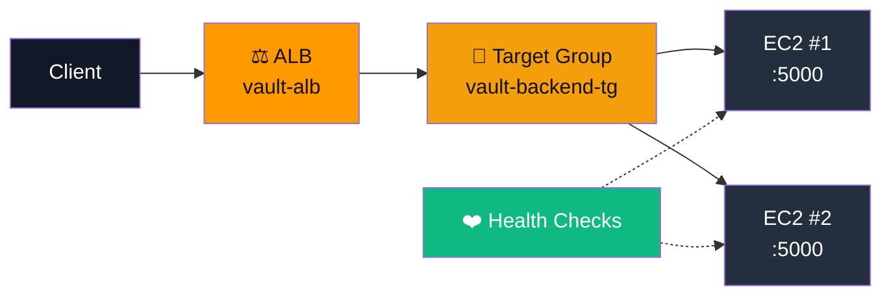

The target group health checks determine whether a backend instance is healthy enough to receive traffic.

---

# 📈 Auto Scaling Architecture

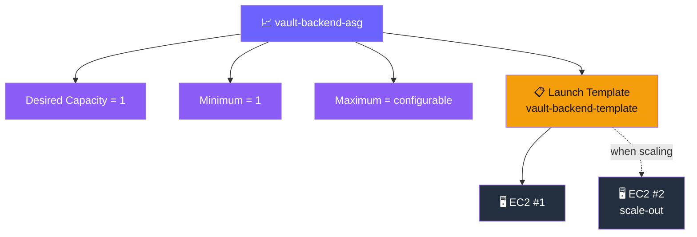

### Why ASG?

Without ASG:

```text
EC2 dies
   ↓
Backend dies
   ↓
Manual recovery
```

With ASG:

```text
EC2 unhealthy
   ↓
ASG detects capacity/health issue
   ↓
New instance can be launched
   ↓
Launch Template provides configuration
   ↓
Target Group health check
   ↓
Traffic returns to healthy capacity
```

---

# 🔒 HTTPS & Vercel Proxy

A key production issue was the browser's **mixed-content restriction**.

The browser loads:

```text
https://vault-frontend-beryl.vercel.app
```

but the original API endpoint was HTTP.

That creates:

```mermaid
flowchart LR

    B["Browser"]
    V["HTTPS Vercel"]
    H["HTTP ALB"]

    B --> V
    V -. "❌ browser blocks insecure request" .-> H

    style B fill:#111827,color:#fff
    style V fill:#000,color:#fff
    style H fill:#FF9900,color:#111
```

The solution was a server-side Vercel rewrite/proxy:

```mermaid
flowchart LR

    B["🌐 Browser"]
    V["▲ Vercel<br/>HTTPS"]
    P["🔀 Server-side Rewrite"]
    A["⚖️ HTTP ALB"]
    E["🖥️ EC2"]

    B -->|"HTTPS"| V
    V --> P
    P -->|"Server-side request"| A
    A --> E

    style B fill:#111827,color:#fff
    style V fill:#000,color:#fff
    style P fill:#6C63FF,color:#fff
    style A fill:#FF9900,color:#111
    style E fill:#232F3E,color:#fff
```

### Why this works

The browser only sees:

```text
Browser
   ↓
HTTPS
Vercel
```

The backend hop happens through the Vercel server-side rewrite rather than as an insecure browser XHR.

---

# 🚀 Deployment Flow

```mermaid
flowchart TB

    DEV["👨‍💻 Local Development"]

    GIT["Git"]
    GH["GitHub"]

    VERCEL["▲ Vercel"]
    AWS["☁️ AWS"]

    FRONT["React Production Build"]
    ALB["ALB"]
    ASG["ASG"]
    EC["EC2"]
    PM2["PM2"]
    API["Node / Express"]

    DEV --> GIT
    GIT --> GH

    GH --> VERCEL
    VERCEL --> FRONT

    GH --> AWS
    AWS --> ASG
    ASG --> EC
    EC --> PM2
    PM2 --> API
    API --> ALB

    style DEV fill:#111827,color:#fff
    style GIT fill:#F59E0B,color:#111
    style GH fill:#181717,color:#fff
    style VERCEL fill:#000,color:#fff
    style AWS fill:#FF9900,color:#111
    style ASG fill:#6C63FF,color:#fff
    style EC fill:#232F3E,color:#fff
    style PM2 fill:#2B2B2B,color:#fff
    style API fill:#339933,color:#fff
```

---

# 🔁 Complete Request Lifecycle

## Example: `GET /files`

```mermaid
sequenceDiagram
    autonumber

    actor U as User
    participant R as React
    participant V as Vercel
    participant A as ALB
    participant E as Express
    participant J as JWT Middleware
    participant C as Controller
    participant P as Prisma
    participant DB as PostgreSQL

    U->>R: Open My Files
    R->>V: GET /files
    V->>A: Proxy request
    A->>E: Forward request
    E->>J: Verify JWT
    J->>C: Authorized request
    C->>P: Query files
    P->>DB: SELECT metadata
    DB-->>P: File records
    P-->>C: Records
    C-->>E: JSON response
    E-->>A: JSON
    A-->>V: JSON
    V-->>R: JSON
    R-->>U: Render file list
```

---

# 🧯 Failure Scenarios

## What if an upload chunk fails?

```mermaid
flowchart TD

    START["Upload Chunk"] --> FAIL{"Chunk accepted?"}

    FAIL -->|"Yes"| NEXT["Continue"]
    FAIL -->|"No"| RETRY["Retry chunk"]

    RETRY --> FAIL

    NEXT --> COMPLETE{"All chunks complete?"}

    COMPLETE -->|"No"| STATUS["Resume status"]
    STATUS --> NEXT

    COMPLETE -->|"Yes"| FINAL["Finalize upload"]

    style START fill:#6C63FF,color:#fff
    style FAIL fill:#F59E0B,color:#111
    style RETRY fill:#EF4444,color:#fff
    style FINAL fill:#10B981,color:#fff
```

## What if an EC2 instance becomes unhealthy?

```mermaid
flowchart TD

    EC["EC2 Instance"]
    HC["Target Group Health Check"]
    BAD["Unhealthy"]
    ASG["Auto Scaling Group"]
    LT["Launch Template"]
    NEW["New EC2"]
    TG["Target Group"]
    TRAFFIC["Traffic"]

    EC --> HC
    HC --> BAD
    BAD --> ASG
    ASG --> LT
    LT --> NEW
    NEW --> TG
    TG --> TRAFFIC

    style EC fill:#232F3E,color:#fff
    style HC fill:#10B981,color:#fff
    style BAD fill:#EF4444,color:#fff
    style ASG fill:#6C63FF,color:#fff
    style LT fill:#F59E0B,color:#111
    style NEW fill:#232F3E,color:#fff
    style TG fill:#FF9900,color:#111
```

## What if Redis is unavailable?

```text
Redis failure
     │
     ├── Temporary upload state may be affected
     │
     ├── Active resumable sessions may need recovery logic
     │
     └── Durable file metadata should remain in PostgreSQL
```

This separation is one reason Redis should not be treated as the permanent source of truth for user files.

---

# 📊 Why This Architecture?

## Why S3 instead of PostgreSQL for files?

```text
PostgreSQL
└── Relational / structured metadata

S3
└── Large binary objects
```

S3 is a natural object-storage layer, while PostgreSQL remains focused on relational application state.

---

## Why PostgreSQL?

Because the application has relationships:

```text
User
  ↓
Files
  ↓
Folders
  ↓
Permissions
  ↓
Shares
```

A relational database makes these relationships queryable and consistent.

---

## Why Redis?

Because some data is:

```text
FAST
TEMPORARY
HIGH-FREQUENCY
```

Examples include upload progress and short-lived operational state.

---

## Why ALB?

```text
Without ALB

Internet
   ↓
EC2
```

```text
With ALB

Internet
   ↓
ALB
   ↓
Healthy Targets
```

The ALB gives the backend a stable entry point and works naturally with target groups and Auto Scaling.

---

## Why ASG?

ASG turns:

```text
"I have one EC2 server"
```

into:

```text
"I have managed backend capacity"
```

It can replace unhealthy instances and scale according to configured capacity/scaling policies.

---

# 🧰 Technology Stack

### Frontend

- React
- Vite
- Axios
- React Router

### Backend

- Node.js
- Express.js
- JWT
- CORS
- Rate limiting
- PM2

### Data

- PostgreSQL
- Prisma
- Redis

### Storage

- Amazon S3

### AWS Infrastructure

- Amazon EC2
- Application Load Balancer
- Target Groups
- Auto Scaling Groups
- Launch Templates
- VPC / Subnets
- Security Groups
- AMI

### Deployment

- GitHub
- Vercel
- AWS

---

# 📂 Project Structure

A simplified view of the repository:

```text
distributed-file-storage-system/
│
├── frontend/
│   ├── src/
│   │   ├── components/
│   │   ├── pages/
│   │   ├── services/
│   │   │   └── api.js
│   │   └── ...
│   ├── public/
│   ├── vercel.json
│   ├── package.json
│   └── vite.config.js
│
├── backend/
│   ├── src/
│   │   ├── controllers/
│   │   ├── middleware/
│   │   ├── routes/
│   │   ├── services/
│   │   ├── utils/
│   │   ├── app.js
│   │   └── ...
│   │
│   ├── prisma/
│   │   └── schema.prisma
│   │
│   ├── package.json
│   └── ...
│
└── README.md
```

---

# 🔌 API Surface

## Authentication

```http
POST /auth/signup
POST /auth/login
GET  /auth/profile
```

## Users

```http
GET /users/search?q=<query>
```

## Files

```http
GET    /files
GET    /files/:id
DELETE /files/:id
GET    /files/:id/download

PATCH  /files/:id
PATCH  /files/:id/move
PATCH  /files/:id/star
PATCH  /files/:id/trash
PATCH  /files/:id/restore
```

## Sharing

```http
POST   /files/:id/share
GET    /files/shared-with-me
GET    /files/:id/shares
DELETE /files/:id/share/:userId
PATCH  /files/:id/share/:userId
```

## Special listings / batch operations

```http
GET  /files/starred
GET  /files/trashed
POST /files/batch-delete
POST /files/batch-move
```

## Folders

```http
GET    /api/folders
GET    /api/folders/:id
POST   /api/folders
PATCH  /api/folders/:id
PATCH  /api/folders/:id/move
PATCH  /api/folders/:id/star
PATCH  /api/folders/:id/trash
PATCH  /api/folders/:id/restore
DELETE /api/folders/:id
```

## Chunked uploads

```http
POST /uploads/init
POST /uploads/:uploadId/chunk
POST /uploads/:uploadId/complete
GET  /uploads/:uploadId/status
```

---

# 🧪 Local Development

## 1. Clone

```bash
git clone https://github.com/pratik3847/distributed-file-storage-system.git
cd distributed-file-storage-system
```

## 2. Backend

```bash
cd backend
npm install
```

Configure environment variables for:

```text
DATABASE_URL
JWT_SECRET
AWS_REGION
AWS_ACCESS_KEY_ID
AWS_SECRET_ACCESS_KEY
AWS_S3_BUCKET
REDIS_URL
PORT
```

Then:

```bash
npm run dev
```

## 3. Frontend

```bash
cd ../frontend
npm install
npm run dev
```

Local frontend:

```text
http://localhost:5173
```

---

# ☁️ Production Deployment

```mermaid
flowchart LR

    CODE["GitHub"]

    CODE --> FE["Vercel"]
    CODE --> BE["AWS EC2"]

    FE --> LIVE["Live React App"]
    BE --> PM2["PM2"]
    PM2 --> API["Express API"]

    API --> ALB["ALB"]
    API --> DB["PostgreSQL"]
    API --> REDIS["Redis"]
    API --> S3["S3"]

    style CODE fill:#181717,color:#fff
    style FE fill:#000,color:#fff
    style BE fill:#FF9900,color:#111
    style PM2 fill:#2B2B2B,color:#fff
    style API fill:#339933,color:#fff
    style ALB fill:#FF9900,color:#111
    style DB fill:#4169E1,color:#fff
    style REDIS fill:#DC382D,color:#fff
    style S3 fill:#569A31,color:#fff
```

### Live frontend

**https://vault-frontend-beryl.vercel.app/**

---

# 💡 Engineering Decisions

### 1. Separate metadata from blobs

```text
Metadata → PostgreSQL
Blobs    → S3
```

### 2. Use chunked uploads

```text
Large file
    ↓
Smaller transfer units
    ↓
Resume / retry
```

### 3. Keep authentication at the API layer

```text
JWT
 ↓
Middleware
 ↓
Identity
 ↓
Authorization
```

### 4. Put the ALB in front of backend compute

```text
Stable public endpoint
        ↓
Healthy targets
```

### 5. Use ASG for managed capacity

```text
Launch Template
       ↓
ASG
       ↓
EC2
```

### 6. Keep the frontend independent

```text
Vercel
   ↓
React deployment

AWS
   ↓
Backend infrastructure
```

This makes frontend delivery independent from backend infrastructure.

---

# 🧠 The Most Important Mental Model

If you remember only one diagram, remember this:

```mermaid
flowchart TB

    USER["👤 USER"]

    UI["⚛️ React / Vercel"]

    EDGE["🔀 Vercel Proxy"]

    LB["⚖️ ALB"]

    COMPUTE["🖥️ EC2<br/>Node + Express + PM2"]

    LOGIC["🧠 Business Logic"]

    DB["🐘 PostgreSQL<br/>Metadata"]

    CACHE["⚡ Redis<br/>Temporary State"]

    BLOB["🪣 S3<br/>File Bytes"]

    USER --> UI
    UI --> EDGE
    EDGE --> LB
    LB --> COMPUTE
    COMPUTE --> LOGIC

    LOGIC --> DB
    LOGIC --> CACHE
    LOGIC --> BLOB

    style USER fill:#111827,color:#fff
    style UI fill:#61DAFB,color:#000
    style EDGE fill:#6C63FF,color:#fff
    style LB fill:#FF9900,color:#111
    style COMPUTE fill:#232F3E,color:#fff
    style LOGIC fill:#10B981,color:#fff
    style DB fill:#4169E1,color:#fff
    style CACHE fill:#DC382D,color:#fff
    style BLOB fill:#569A31,color:#fff
```

---

# 🎯 Resume-Level Summary

> **Vault is a distributed cloud file storage platform that separates binary object storage from relational metadata, supports resumable chunked uploads, JWT-secured file operations, folder organization, sharing and soft-delete workflows, and is deployed using a Vercel-hosted React frontend backed by Node.js/Express running on AWS EC2 behind an Application Load Balancer and Auto Scaling Group, with PostgreSQL, Redis, and Amazon S3 forming the data layer.**

---

# 🛣️ Future Evolution

The original architectural roadmap explored a larger evolution toward event-driven microservices, Kafka, device synchronization, an API gateway, Docker, and additional AWS-managed infrastructure.

Those components are **future architectural directions, not claims about the currently deployed implementation**.

```mermaid
flowchart LR

    CURRENT["🚀 CURRENT VAULT"]

    CURRENT --> KAFKA["Kafka / Event Bus"]
    KAFKA --> SYNC["Sync Service"]
    CURRENT --> GATEWAY["Dedicated API Gateway"]
    CURRENT --> DOCKER["Containerization"]
    CURRENT --> OBS["Advanced Observability"]

    SYNC --> DEVICES["💻 Laptop<br/>📱 Phone<br/>📟 Tablet"]

    style CURRENT fill:#10B981,color:#fff
    style KAFKA fill:#231F20,color:#fff
    style SYNC fill:#6C63FF,color:#fff
    style GATEWAY fill:#FF9900,color:#111
    style DOCKER fill:#2496ED,color:#fff
    style OBS fill:#8B5CF6,color:#fff
    style DEVICES fill:#111827,color:#fff
```

---

# 📚 What I Learned Building Vault

This project is intentionally more than a CRUD application.

It combines:

```text
Frontend Engineering
        +
REST API Design
        +
Authentication
        +
Relational Data Modeling
        +
Object Storage
        +
Chunked File Transfer
        +
Caching / Temporary State
        +
Cloud Networking
        +
Load Balancing
        +
Auto Scaling
        +
Production Deployment
```

The biggest lesson:

> **Distributed systems are not created by adding more servers. They are created by deciding where state, computation, storage, traffic, and failure boundaries belong.**

---

# ⭐ Project Status

```text
██████████████████████████████████████████████████  DEPLOYED

Frontend       ██████████████████████████████████  ✅
REST API       ██████████████████████████████████  ✅
JWT Auth       ██████████████████████████████████  ✅
PostgreSQL     ██████████████████████████████████  ✅
Prisma         ██████████████████████████████████  ✅
S3 Storage     ██████████████████████████████████  ✅
Redis          ██████████████████████████████████  ✅
Chunk Upload   ██████████████████████████████████  ✅
File Sharing   ██████████████████████████████████  ✅
Folders        ██████████████████████████████████  ✅
AWS EC2        ██████████████████████████████████  ✅
ALB            ██████████████████████████████████  ✅
ASG            ██████████████████████████████████  ✅
Vercel         ██████████████████████████████████  ✅
```

---

<p align="center">

### ☁️ Built as a serious systems project.

**Vault — store it. organize it. share it.**

<br/>

<a href="https://vault-frontend-beryl.vercel.app/">
  <strong>🚀 OPEN VAULT LIVE DEMO →</strong>
</a>

</p>
